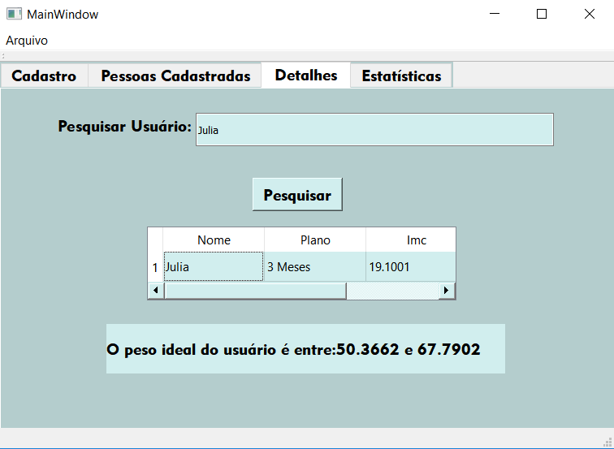

# Academia-Software
Inscrição, acompanhamento e estatísticas de uma academia

O Academia-Software foi desenvolvido para ser útil em situações de cadastro de pessoas em academias, tornando uma tarefa enfadonha e exaustiva numa forma descomplicada de matrículas. Com uma interface simples, podemos realizar o cadastro de diversas pessoas e organizalas com apenas um "click". A figura abaixo mostra a tela inicial da aplicação:

Nessa aba você pode adcionar todas as informações necessárias para realizar o cadastramento. Sendo possível inscrever um número ilimitado de pessoas.

Exemplo de cadastro

# Pessoas cadastradas
Após realizado o cadastro, as informações mais importantes de cada cliente são salvos em uma tabela e imediatamente é calculado o IMC, que vai ser utilizado e de extrema importância nas próximas etapas do programa,todos os clientes podem ser encontrados nessa aba, como mostra a figura a seguir.

Nesta mesma aba existem os botões para fazer a ordenação por ordem alfabética ou por Imc, que é feito de forma crescente.

Ordenação por ordem alfabética

Ordenação por Imc

# Detalhes

A proxima aba é de detalhes, uma das mais importantes do programa. Nela é possivel pesquisar o nome de pessoas já cadastradas e obter mais informações. Como podemos ver a seguir:

Com o cálculo do IMC podemos checar se uma pessoa está acima do peso, o cálculo é feito pela equação: IMC = peso/(altura)^2, um IMC considerado saudável é entre 18.5 e 24.9, o peso aconselhável pode ser dado por uma equação que serve para todas as pessoas, como sabemos o intervalo de peso aconselhável, então substituimos o IMC na equação, e isolamos o peso, pois é ele que queremos encontrar então a equação vai ser dada por: peso = IMC*(altura)^2, então se uma pessoa tem determinada altura podemos encontrar seu intervalo de peso saudável. Essa aba também mostra mais detalhes da pessoa que foi pesquisada, como o plano de academia escolhido.

# Estatísticas

A proxima aba mostra as estatísticas da academia, tais como a quantidade de pessoas e pessoas acima do peso.

